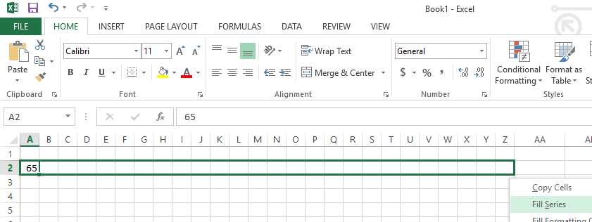
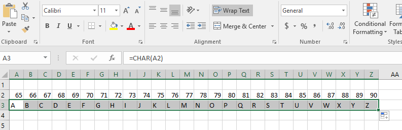
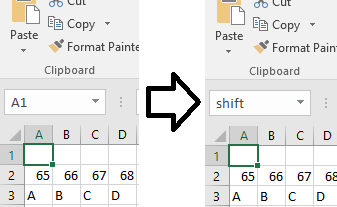
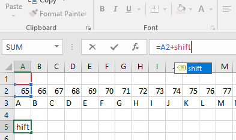
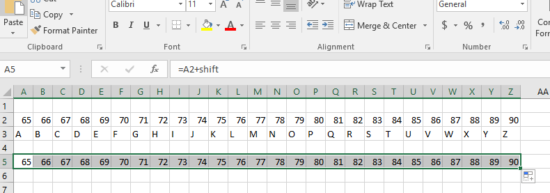
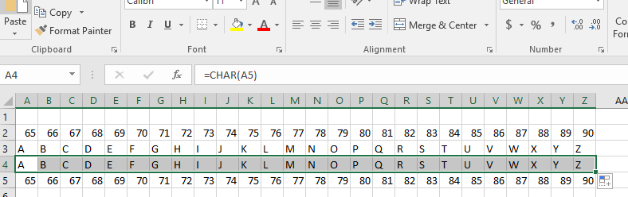
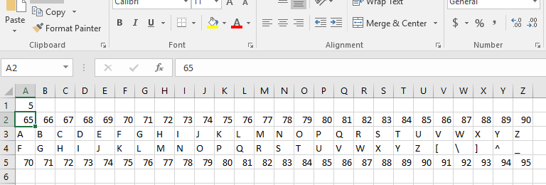
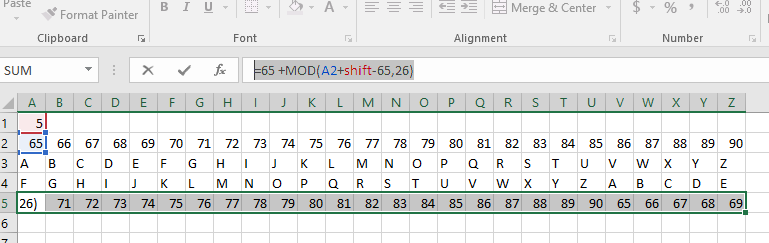
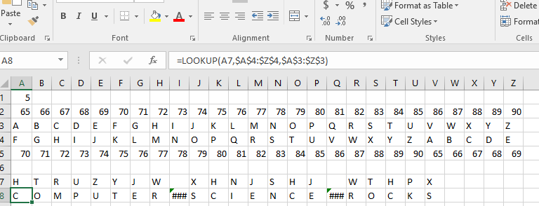

# Build a Caesar Cipher Decryption Tool
The [Caesar Cipher](https://learncryptography.com/classical-encryption/caesar-cipher) is one of the simplest forms of encryption. It is a substitution cipher where each letter in the original message (called the plaintext) is replaced with a letter corresponding to a certain number of letters up or down in the alphabet. In this lab we will use Microsoft Excel to build a spreadsheet that we can use to decrypt ("crack") secret coded messages.   

Start by creating a new spreadsheet in Excel. Choose *Excel | Blank Workbook*. Then we will [use Excels fill handle to create the alphabet](https://www.techrepublic.com/blog/microsoft-office/using-excels-fill-handle-to-create-an-alphabetic-list/). Type `65` in cell `A2`. Right click on the right bottom of cell `A2` and drag to the right to `fill series` to cell `Z2` as shown below.

Now we'll write a formula in cell `A3` to convert `65` to its ASCII character. Enter the formula `=CHAR(A2)` then left click on the bottom right of cell `A3` and fill through cell `Z3` as shown below.   

Now we are going to add a variable so we can introduce different amounts of "shift." Click on cell `A1` and right above it change 'A1' to 'shift'.

Now click on cell `A5`. We are going to write a formula `=A2+shift`

Now left click on the bottom right of cell `A3` and fill through cell `Z3` as shown below.

Now we'll write a formula in cell `A4` to convert the values in row 5 below to the corresponding ASCII character. Enter the formula `=CHAR(A5)` then left click on the bottom right of cell `A4` and fill through cell `Z4` as shown below.

Now lets type something in cell `A1` to introduce some `shift`. Type `5` in cell `A1`, hit enter, and see what happens. It should look like the screen below.

The problem is that after the number `90` we "run out" of letters of the alphabet. We are going to use the modulus function to "wrap the numbers" back to 65 to start at the beginning of the alphabet. In cell `A5` change the formula to `=65 +MOD(A2+shift-65,26)` and then left click in the bottom right corner and fill to cell `Z5`. The result should look like the picture below.

Now enter the following secret message on row 7 one character per cell: HTRUZYJW XHNJSHJ WTHPX. Type the following code to translate the secret message in cell `A8`: `=LOOKUP(A7,$A$4:$AA$4,$A$3:$AA$3)` and click and drag of the right bottom of cell `A8` and fill through cell `Z8`. You should see the following decoded message.

Now that you have a working Caesar Cipher Decrypter, see if you can decrypt the following secret messages. You will have to guess the `shift` in each of the following Caesar Ciphers.

-IPM GTUDGB
-BZKK NE CTSX
-NFICU JVIZVJ
-QXLDB YXLDB
-EJB EF MPT NVFSUPT

Optional
========
If you have extra time, see if you can write a `=LOOKUP` function to *encrypt* a plain text message into Caesar Cipher code. Find a partner and see if they can decrypt your encrypted message.
